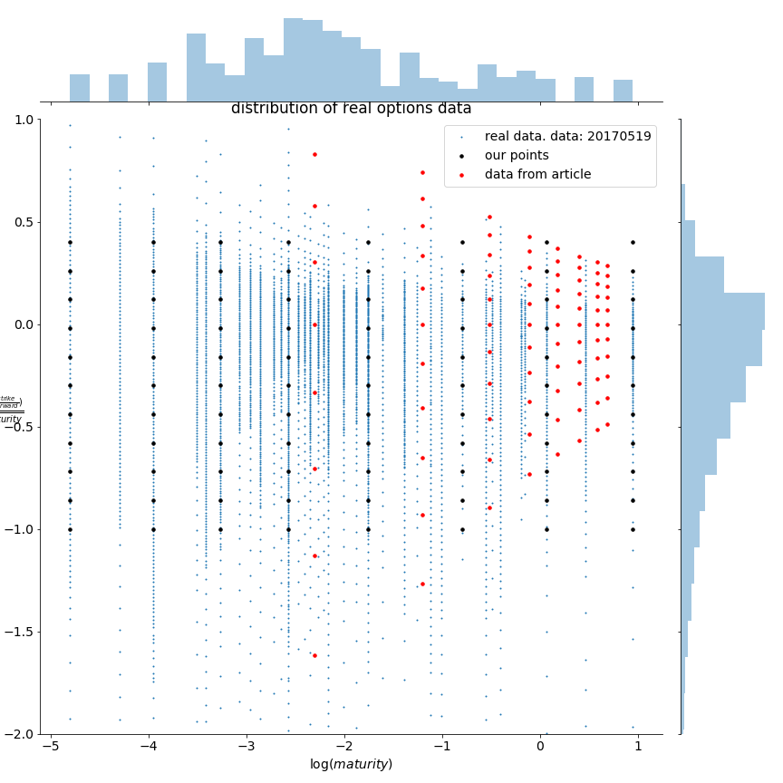
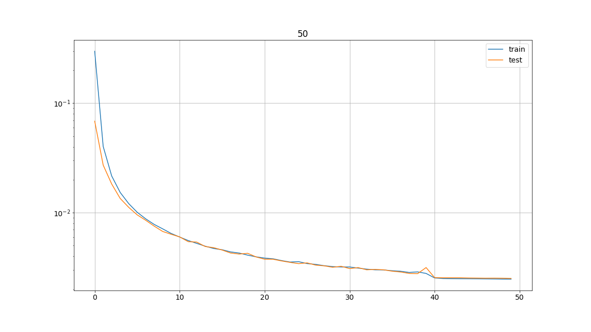
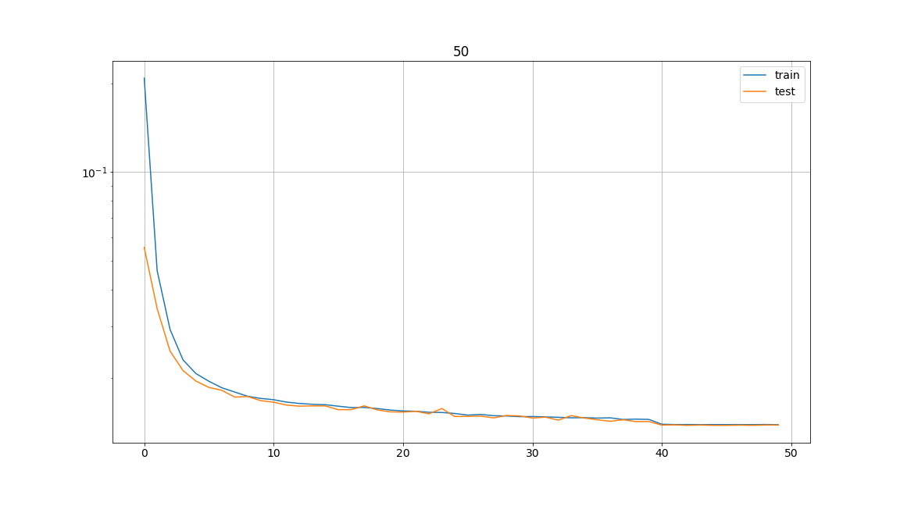
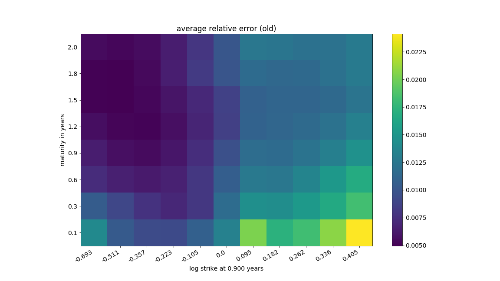
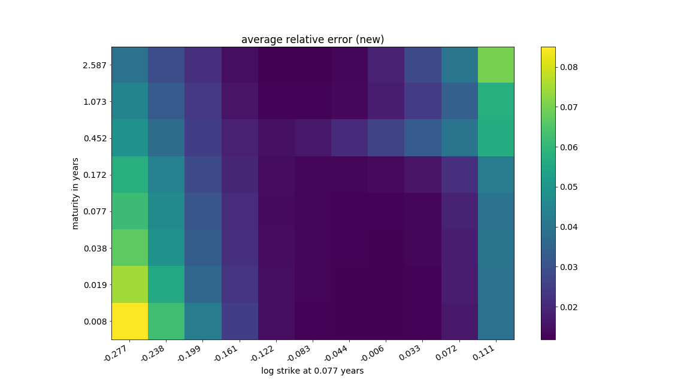
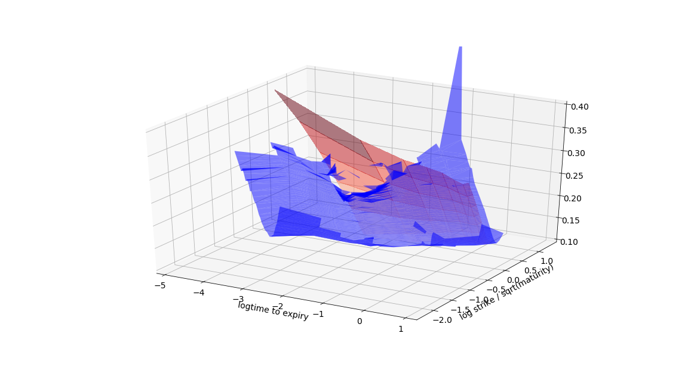
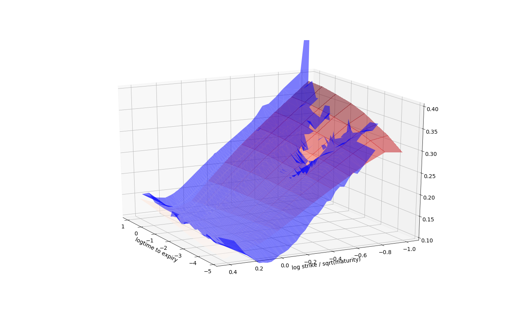

# Project Description

The code provided in the repository allows rough Bergomi parameters estimation (both forward variance curve and the model parameters) given any volatility surface. The data used in the original article seems to be too concentrated at large maturitites so we proposed another (irregular grid).

The final code can be found at notebooks/GetParamsFromSurface.ipynb with interactive 3D plotting.

# Authors

Done by Alexander Pukhov and Ryan O'Connor as a capstone project at Baruch College supervised by Prof. Jim Gatheral.

The work is based on the article:
https://github.com/amuguruza/NN-StochVol-Calibrations and the paper https://papers.ssrn.com/sol3/papers.cfm?abstract_id=3322085

# Structure of the repository and "How to run"

## Less important
- images -- dynamically updating pictures when code in notebooks is executed. Note: this README automatically changes based on images from this folder!
- lbfgs_wrapper -- pytorch optimizers does not support bound so we had to use scipy wrapper.
- data_generation module (code is kindly provided by Prof. Jim Gatheral) generates rBergomi surfaces
- models -- stores weights of neural network models
- utils -- data preprocessing is here

## More important
- dplot -- pretty ploting of 3D surfaces from different sources
- load_surfaces -- loads data and returns them in (almost) the same format from 3 different sources: original data, our rBergomi surfaces, real volatility surface data extracted from .csv file.
    Note: from real volatility surface data we really need points on a given grid, therefore we need to interpolate and sometimes extrapolate data from real surface. As real data is unstructured I could not find an algorithm that both interpolates and extrapolates this kind of data, thus I used KNN which, roughly speaking, has Dirichlet boundary conditions.
- notebooks/ModelTraining -- run this code both for "old" and "new" type to generate and save model parameters to models folder. This step has been already done and can be omitted.

## The most importnant
- paths -- if something is not working check this file first, it contains "global" paths.
- notebooks/GetParamsFromSurface -- the main notebook which produces Heston params given a surface

# Results

## Grid comparison

## Loss curve comparison

### OLD

### NEW

## Average relative on grid comparison

## Optimal params comparison

### OLD

### NEW

## Fit for 2013-08-14

### OLD

### NEW

